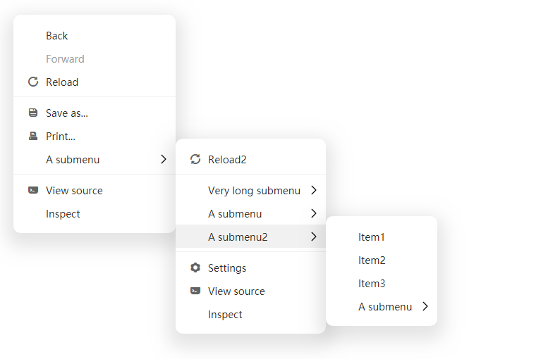

vue3-context-menu
---
A context menu component for Vue3



[中文说明](./README.CN.md)

---

[View Demo](https://imengyu.top/pages/vue3-context-menu-demo/)

---

### Install

```
npm install -save @imengyu/vue3-context-menu
```

### Usage

#### Options API

Import vue3-context-menu in main.js:
```js
import '@imengyu/vue3-context-menu/lib/vue3-context-menu.css'
import ContextMenu from '@imengyu/vue3-context-menu'

createApp(App)
  .use(ContextMenu)     
```

Add events to the elements that you want show contextmenu: 
```html
<div class="box" @contextmenu="onContextMenu($event)">
  Right click to show contextmenu.
</div>
```

Then show your menu:
```js
onContextMenu(e : MouseEvent) {
  //prevent the browser's default menu
  e.preventDefault();
  //show our menu
  this.$contextmenu({
    x: e.pageX,
    y: e.pageY,
    items: [
      { 
        label: "A menu item", 
        onClick: () => {
          alert("You click a menu item");
        }
      },
      { 
        label: "A submenu", 
        children: [
          { label: "Item1" },
          { label: "Item2" },
          { label: "Item3" },
        ]
      },
    ]
  });
}
```

Similarly, you can use component to display the menu:

```html
<context-menu v-model:show="show" :options="options" />
```

```js
data() {
  return {
    show: false,
    options: {
      items:[
        {
          label: "Copy",
          onClick: () => {
            document.execCommand('copy');
          }
        },
        { label: "Paste", disabled: true },
        {
          label: "Print",
          icon: 'icon-print',
          onClick: () => {
            document.execCommand('print');
          }
        },
      ],
      iconFontClass: 'iconfont',
      customClass: "class-a",
      minWidth: 230,
      x: 0,
      y: 0
    }
  }
},
methods: {
  onButtonClick(e : MouseEvent) {
    //Show menu
    this.show = true;
    this.options.x = e.pageX;
    this.options.y = e.pageY;
  },
}
```

#### Composition API with `setup`

Use the Composition Api? Use this component like this:

```vue
<script setup>
    import ContextMenu from "@imengyu/vue3-context-menu";
    
    // showContextMenu is same as `this.$contextmenu`
    ContextMenu.showContextMenu({
        ...
    })
</script>
```

### Parameter description

#### MenuOptions

| Attribute | description | type | optional value | default value|
| :----: | :----: | :----: | :----: | :----: |
| items | The items for this menu. | `MenuItem[]` | — | — |
| x | Menu display x position. | `number` | — | `0` |
| y | Menu display y position. | `number` | — | `0` |
| xOffset | X-coordinate offset of submenu and parent menu. | `number` | — | `0` |
| yOffset | Y-coordinate offset of submenu and parent menu. | `number` | — | `0` |
| iconFontClass | Custom icon library font class name. | `string` | — | `iconfont` |
| zIndex | The z-index of this menu. | `number` | — | `2` |
| customClass | Custom menu class. | `string` | — | — |
| minWidth | Minimum width of main menu (in pixels) | `number` | — | `100` |
| maxWidth | Maximum width of main menu (in pixels) | `number` | — | `600` |

#### MenuItem

| Attribute | description | type | optional value | default value|
| :----: | :----: | :----: | :----: | :----: |
| label | The label of menu. | `string` | — | — |
| icon | The icon for menu item. | `string` | — | — |
| disabled | Disable menu item? | `boolean` | — | `false` |
| divided | Is this menu item separated from the menu item below? | `boolean` | — | `false` |
| customClass | Custom submenu class. | `string` | — | — |
| minWidth | Submenu minimum width (in pixels). | `number` | — | `100` |
| maxWidth | Submenu maximum width (in pixels). | `number` | — | `600` |
| onClick | Menu item click event handler. | `Function()` | — | — |
| children | Submenu items. | `MenuItem[]` | — | — |
